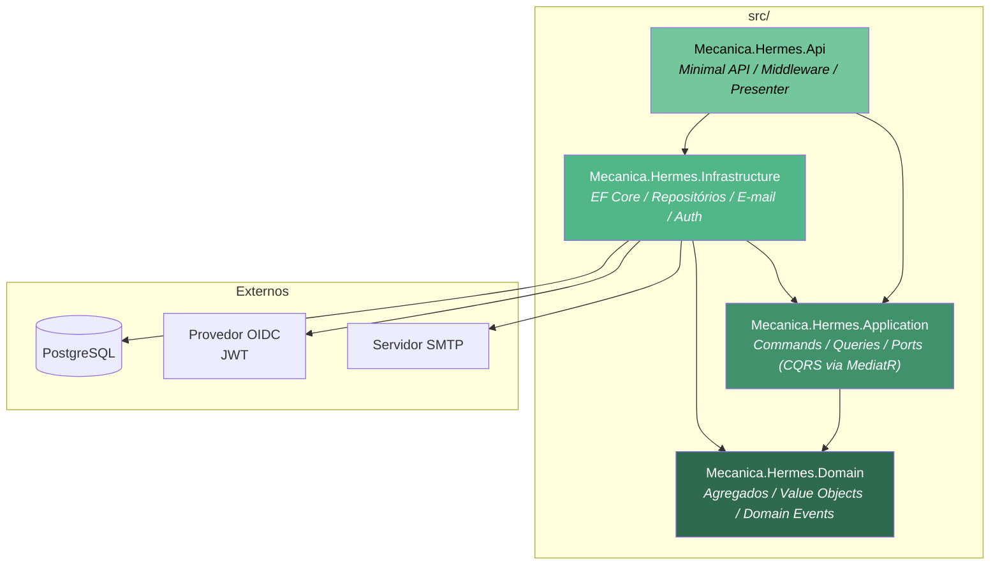

# Mecânica Hermes

> Sistema de gerenciamento para oficinas mecânicas desenvolvido como parte do Tech Challenge da FIAP

[](https://opensource.org/licenses/MIT)
[](https://dotnet.microsoft.com/)
[](https://www.postgresql.org/)

## Sobre o Projeto

O **Mecânica Hermes** é um sistema de gerenciamento para oficinas mecânicas que cobre o ciclo completo de atendimento: cadastro de clientes e veículos, abertura e acompanhamento de ordens de serviço, controle de estoque de produtos e serviços, e notificações por e-mail.

> A documentação técnica detalhada está centralizada em [`docs/`](./docs).

A implementação está dividida em 5 fases. Para os detalhes de cada fase, veja os [objetivos do projeto](./docs/Objetivos.md).

- [x] **Fase 1**: Implementação inicial em arquitetura monolítica
  - [Vídeo Apresentação](https://youtu.be/vqCq9GZKD4Y)
- [x] **Fase 2**: Refatoração para Clean Architecture + DDD + CQRS e CI/CD
  - [Vídeo Apresentação](https://youtu.be/dIGouFP6PU0)
- [ ] Fase 3
- [ ] Fase 4
- [ ] Fase 5

## Arquitetura

O projeto implementa **Clean Architecture** com **Domain-Driven Design (DDD)** e **CQRS**, organizado em quatro projetos com dependências unidirecionais:



Destaques da arquitetura atual:

- **Minimal API** (sem controllers) com rotas agrupadas por recurso.
- **State Pattern** para o ciclo de vida da Ordem de Serviço (8 estados, transições controladas pelo domínio).
- **Domain Events** despachados via MediatR após commit da Unit of Work.
- **Entidades de persistência desacopladas** do domínio — o EF Core opera sobre classes `*Entity`, nunca sobre agregados.
- **Result Pattern** em todo o domínio e camada de aplicação, com mapeamento direto para respostas HTTP.
- **Autenticação JWT** via provedor externo (OIDC), com middleware de bypass para desenvolvimento.

Mais detalhes: [Arquitetura do Projeto](./docs/Arquitetura-projeto.md).

## CI/CD

Dois workflows de GitHub Actions automatizam a integração e entrega:

- **`build-and-tests-ci.yml`** — build, testes unitários e de integração (Testcontainers) e validação de cobertura ≥ 70%.
- **`docker-ci.yml`** — build e publicação da imagem Docker no Docker Hub (`mechermes/mecanica-hermes-api`), com suporte a `linux/amd64` e `linux/arm64`.

Mais detalhes: [CI/CD](./docs/CI-CD.md).

## Deploy via Pipeline

Este repositório possui pipelines de build/publicação da imagem e gatilho de deploy para o repositório Kubernetes.

### Workflows

| Workflow | Objetivo |
| --- | --- |
| `build-and-tests-ci.yml` | Build e execução de testes automatizados |
| `docker-ci.yml` | Build e publicação da imagem `mechermes/mecanica-hermes-api` |
| `k8s-deploy-trigger.yml` | Disparo de deploy no repositório `mecanica-hermes-k8s` |

### Secrets e variáveis necessários neste repositório

| Tipo | Nome | Uso |
| --- | --- | --- |
| Secret | `DOCKER_USERNAME` | Autenticação no Docker Hub |
| Secret | `DOCKER_PASSWORD` | Autenticação no Docker Hub |
| Secret | `K8S_REPO_PAT` | Token para disparar workflow no repositório `mecanica-hermes-k8s` |

### Fluxo recomendado

1. Fazer merge para `main` (gera imagem e tag de branch automaticamente).
2. Confirmar publicação da imagem no Docker Hub.
3. Validar execução do deploy no repositório `mecanica-hermes-k8s`.

> **Observação:** o deploy operacional da aplicação (manifests, secrets de runtime e New Relic) acontece no repositório `mecanica-hermes-k8s`.

## Início Rápido

### Pré-requisitos

- [.NET 10 SDK](https://dotnet.microsoft.com/download/dotnet/10.0)
- [Docker](https://www.docker.com/get-started) (recomendado para ambiente completo)
- [PostgreSQL 16](https://www.postgresql.org/download/) (se preferir não usar Docker)

### Executar com Docker Compose

A forma mais rápida de executar o ambiente completo de desenvolvimento (PostgreSQL + pgAdmin + Mailpit):

```bash
cd docker-compose
docker-compose up -d
```

Em seguida, execute a API localmente:

```bash
dotnet run --project src/Mecanica.Hermes.Api
```

**Serviços disponíveis após inicialização:**

| Serviço | URL |
| --- | --- |
| API | <http://localhost:8080> |
| Health Check | <http://localhost:8080/health> |
| Scalar UI (docs) | <http://localhost:8080/scalar/v1> |
| PostgreSQL | `localhost:5432` |
| Mailpit (e-mail) | <http://localhost:8025> |

> As migrações do banco de dados são aplicadas automaticamente na inicialização da API (`MigrateDatabaseAsync`).

### Executar sem Docker

```bash
# Configure a connection string via variável de ambiente
$env:ConnectionStrings__DefaultConnection = "Host=localhost;Database=mecanica_hermes;Username=postgres;Password=..."

# Execute a API
dotnet run --project src/Mecanica.Hermes.Api
```

### Variáveis de Ambiente

| Variável | Descrição | Obrigatória em Produção |
| --- | --- | --- |
| `ConnectionStrings__DefaultConnection` | Connection string do PostgreSQL | Sim |
| `AUTH__AUTHORITY` | Endpoint OIDC do provedor de identidade | Sim |
| `AUTH__ISSUER` | Issuer JWT esperado | Sim |
| `AUTH__CLIENTE_SCOPE` | Nome do scope para acesso de cliente | Sim |
| `AUTH__ADMIN_SCOPE` | Nome do scope para acesso administrativo | Sim |
| `MediatR__LicenseKey` | Chave de licença do MediatR | Sim |
| `AutoMapper__LicenseKey` | Chave de licença do AutoMapper | Sim |
| `EmailSender__Enabled` | Habilita ou desabilita o envio de e-mails | Não |
| `EmailSender__SmtpServer` | Servidor SMTP para envio de e-mails | Sim (se habilitado) |
| `EmailSender__SmtpPort` | Porta do servidor SMTP | Sim (se habilitado) |
| `EmailSender__SslRequired` | Indica se SSL é obrigatório para conexão SMTP | Não |
| `EmailSender__UserName` | Nome de usuário para autenticação SMTP | Não |
| `EmailSender__Password` | Senha para autenticação SMTP | Não |
| `EmailSender__SenderInformation__Name` | Nome do remetente dos e-mails | Sim (se habilitado) |
| `EmailSender__SenderInformation__Address` | Endereço de e-mail do remetente | Sim (se habilitado) |

> Em ambiente `Development` ou `Testing`, a autenticação é bypassada automaticamente — nenhuma variável `AUTH__*` é necessária.

## Documentação da API

A documentação interativa está disponível via **Scalar UI** em execução local:

<http://localhost:8080/scalar/v1>

Também estão disponíveis coleções de requisições via Postman: <https://www.postman.com/gelonezi/mecnica-hermes/>

## Executar os Testes

```bash
# Todos os testes (requer Docker para os testes de integração)
dotnet test Mecanica.Hermes.sln

# Apenas testes unitários (sem Docker)
dotnet test tests/Mecanica.Hermes.Domain.Tests
dotnet test tests/Mecanica.Hermes.Application.Tests
```

## Links Úteis

- [Objetivos do Projeto](./docs/Objetivos.md)
- [Arquitetura do Projeto](./docs/Arquitetura-projeto.md)
- [Diagrama de Componentes](./docs/Diagrama-componentes.md)
- [Autenticação e Autorização](./docs/Auth.md)
- [Fluxo de Autenticação e Abertura de OS](./docs/Fluxo-autenticacao-e-abertura-os.md)
- [Fluxo de Ordem de Serviço](./docs/Fluxo-ordem-servico.md)
- [Banco de Dados](./docs/Banco-de-dados.md)
- [RFCs](./docs/RFCs.md)
- [ADRs](./docs/ADRs.md)
- [Tecnologias Utilizadas](./docs/Tecnologias.md)
- [CI/CD](./docs/CI-CD.md)

## Equipe de Desenvolvimento

Desenvolvido pelo **Tech Challenge 13SOAT** — FIAP

| Nome | RM | Discord | Email |
| --- | --- | --- | --- |
| Allef Cleiton de F. Campos | 367214 | allefcampos2179 | <allef-cleiton88@hotmail.com> |
| Anderson Nunes de Souza Adorno | 364815 | anderson_nsa | <anderson.nunes1988@gmail.com> |
| Leandro Borgo Battochio | 368100 | sheenbr | <lbattochio@hotmail.com> |
| Matheus Alonso Scherma | 368955 | mscherma | <matheus.scherma@gmail.com> |
| Rogério dos Santos Gelonezi | 368238 | rogergelonezi | <rogeriogelonezi@gmail.com> |
