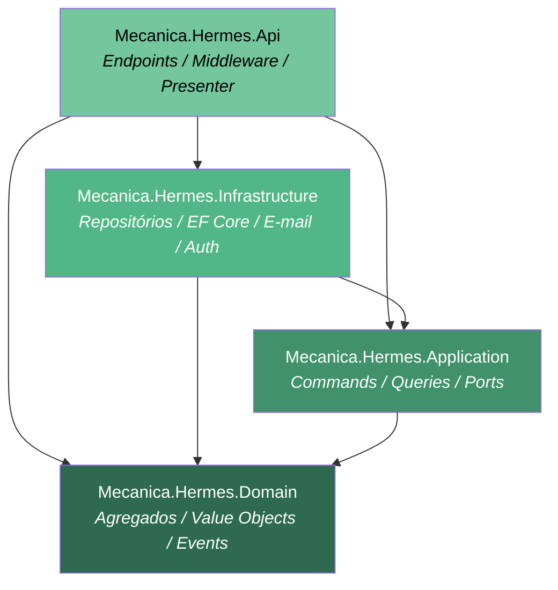
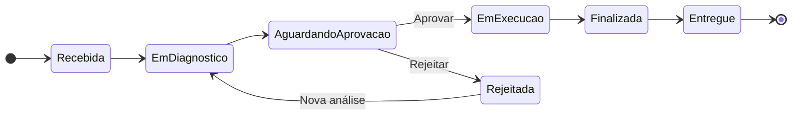

# Arquitetura

O projeto implementa **Clean Architecture** com **Domain-Driven Design (DDD)** e **CQRS (Command Query Responsibility Segregation)**, organizando o código em camadas bem definidas com responsabilidades específicas e baixo acoplamento.

```text
Mecanica.Hermes.sln
├─ src/
│  ├─ Mecanica.Hermes.Api               # Endpoints Minimal API / Middleware / Presenter
│  ├─ Mecanica.Hermes.Application       # Casos de Uso / Commands / Queries / Ports
│  ├─ Mecanica.Hermes.Domain            # Agregados / Value Objects / Domain Events
│  └─ Mecanica.Hermes.Infrastructure    # Repositórios / EF Core / E-mail / Auth
└─ tests/
   ├─ Mecanica.Hermes.Domain.Tests          # Testes unitários do domínio
   ├─ Mecanica.Hermes.Application.Tests     # Testes unitários da camada de aplicação
   ├─ Mecanica.Hermes.Infrastructure.Tests  # Testes unitários da infraestrutura
   └─ Mecanica.Hermes.IntegrationTests      # Testes de integração (Testcontainers + PostgreSQL)
```

## Detalhamento das Camadas

### Mecanica.Hermes.Api (Camada de Apresentação)

**Responsabilidade**: Expõe a API REST utilizando **Minimal API** do ASP.NET Core — sem Controllers tradicionais.

```text
Mecanica.Hermes.Api/
├─ Endpoints/
│  ├─ Clientes/
│  │  ├─ Contracts/       # Request/Response contracts dos endpoints
│  │  ├─ Mappings/        # AutoMapper profiles (Contrato → DTO de Aplicação)
│  │  ├─ Routes/          # Definição de cada rota (MapGet, MapPost, etc.)
│  │  └─ ClientesEndpoints.cs  # Agrupamento e registro das rotas
│  ├─ OrdensDeServico/    # Idem para Ordens de Serviço
│  └─ Produtos/           # Idem para Produtos e Serviços
├─ Middleware/
│  ├─ GlobalExceptionHandlerMiddleware.cs    # Tratamento centralizado de exceções
│  ├─ DevelopmentAuthenticationMiddleware.cs # Autenticação simplificada em DEV/Testing
│  └─ MiddlewareExtensions.cs
├─ Presenter/
│  ├─ ResultPresenterExtensions.cs   # Conversão de Result<T> → IResult HTTP
│  ├─ PaginationHelper.cs            # Helpers para respostas paginadas
│  ├─ PaginatedResponse.cs           # Modelo de resposta paginada
│  └─ ApiProblemDetails.cs           # Modelo de erro padronizado (RFC 7807)
└─ Program.cs                        # Composition root e pipeline HTTP
```

**Características:**

- **Minimal API**: Rotas definidas como métodos estáticos de extensão, agrupadas por recurso com `MapGroup`.
- **Presenter Layer**: `ResultPresenterExtensions` converte `Result<T>` do domínio diretamente para respostas HTTP (`IResult`), eliminando código repetitivo nos endpoints.
- **Tratamento de erros centralizado**: `GlobalExceptionHandlerMiddleware` captura exceções não tratadas e retorna `ApiProblemDetails` com nível de detalhe variável por ambiente.
- **Documentação automática**: OpenAPI + Scalar UI em `/scalar/v1`.
- **Health checks** registrados em `/health`.

### Mecanica.Hermes.Application (Camada de Aplicação)

**Responsabilidade**: Orquestra casos de uso seguindo CQRS via MediatR.

```text
Mecanica.Hermes.Application/
├─ Clientes/
│  ├─ Commands/            # Operações de escrita
│  │  ├─ AddCliente/       # Command + Handler
│  │  ├─ UpdateCliente/
│  │  ├─ DeleteCliente/
│  │  ├─ AddVeiculo/
│  │  ├─ UpdateVeiculo/
│  │  └─ DeleteVeiculo/
│  ├─ Queries/             # Operações de leitura
│  │  ├─ GetClienteById/
│  │  ├─ GetClienteByEmail/
│  │  ├─ GetClienteByIdentificacaoFiscal/
│  │  ├─ ListAllClientes/
│  │  └─ ListClientesByNome/
│  ├─ Dtos/                # ClienteDto, VeiculoDto
│  ├─ Mappings/            # AutoMapper profile (Domínio → DTO)
│  └─ Ports/               # IClienteRepository (Port / interface de saída)
├─ OrdensDeServico/        # Idem para Ordens de Serviço (10 commands, 3 queries)
├─ Produtos/               # Idem para Produtos e Serviços (6 commands, 6 queries cada)
└─ Common/
   ├─ Dtos/                # EmailMessage (DTO compartilhado)
   ├─ Persistence/         # IUnitOfWork
   └─ Ports/               # IEmailSenderService
```

**Características:**

- **CQRS com MediatR**: cada comando e query é um `record` que implementa `IRequest<Result<T>>`. O handler correspondente implementa `IRequestHandler`.
- **Result Pattern**: todos os handlers retornam `Result<T>` ou `Result` (sem dados), evitando exceptions para fluxos de negócio.
- **Ports (Portas de saída)**: interfaces de repositório e serviços externos são definidas aqui e implementadas na Infrastructure (Ports & Adapters).
- **AutoMapper**: profiles de mapeamento de entidades de domínio para DTOs de resposta.

### Mecanica.Hermes.Domain (Camada de Domínio)

**Responsabilidade**: Encapsula regras de negócio e o modelo de domínio puro, sem dependências externas.

```text
Mecanica.Hermes.Domain/
├─ Clientes/
│  ├─ Cliente.cs           # Agregado raiz (AggregateRoot)
│  ├─ Veiculo.cs           # Entidade filha
│  ├─ Events/              # ClienteCriadoEvent, VeiculoAdicionadoEvent, ...
│  └─ ValueObjects/        # NomeProprioVo, EmailVo, TelefoneVo, IdentificacaoFiscalVo, PlacaVo
├─ OrdensDeServico/
│  ├─ OrdemDeServico.cs            # Agregado raiz
│  ├─ OrdemDeServicoProduto.cs     # Entidade filha
│  ├─ OrdemDeServicoServico.cs     # Entidade filha
│  ├─ OrdemDeServicoHistoricoStatus.cs
│  ├─ Abstractions/
│  │  ├─ OrdemDeServicoStatusBase.cs   # Classe base para o State Pattern
│  │  └─ IOrdemDeServicoStatus.cs
│  ├─ Status/              # State Pattern — 8 estados concretos
│  │  ├─ OrdemDeServicoEmDiagnostico
│  │  ├─ OrdemDeServicoAguardandoAprovacao
│  │  ├─ OrdemDeServicoEmExecucao
│  │  ├─ OrdemDeServicoFinalizada
│  │  ├─ OrdemDeServicoEntregue
│  │  ├─ OrdemDeServicoRecebida
│  │  ├─ OrdemDeServicoCancelada
│  │  └─ OrdemDeServicoRejeitada
│  ├─ Events/              # OrdemDeServicoCriadoEvent, EtapaAvancadaEvent, CanceladaEvent
│  └─ Enums/               # OrdemDeServicoStatus
├─ Produtos/
│  ├─ Produto.cs           # Agregado raiz
│  ├─ Servico.cs           # Agregado raiz independente
│  ├─ Events/              # ProdutoCriadoEvent, EstoqueAdicionadoEvent, ...
│  ├─ Enums/               # TipoProduto
│  └─ ValueObjects/        # DescricaoProdutoVo, ValorProdutoVo, QuantidadeProdutoVo
└─ Common/
   ├─ Abstractions/
   │  ├─ BaseDomain.cs          # Id (Guid), CreatedAt, UpdatedAt, IsDeleted
   │  ├─ AggregateRoot.cs       # Coleção de DomainEvents + AddDomainEvent/Clear
   │  ├─ IDomainEvent.cs        # Marcador para eventos de domínio
   │  └─ IDomainEventDispatcher.cs
   ├─ Results/
   │  └─ Result.cs              # Result e Result<T> com StatusCode HTTP
   ├─ Helpers/                  # Utilitários de domínio
   └─ Pagination/               # PaginationParams, PagedResult<T>
```

**Características:**

- **Agregados**: `Cliente`, `OrdemDeServico`, `Produto` e `Servico` são agregados raiz que herdam de `AggregateRoot`. A construção pública é feita via factory methods estáticos (`Criar(...)`) que retornam `Result<T>`.
- **Reconstituição (Restaurar)**: método `internal static Restaurar(...)` usado pelos repositórios para recriar agregados a partir de entidades de persistência, sem disparar regras de negócio.
- **Value Objects**: validação encapsulada e imutabilidade garantida. Ex.: `EmailVo`, `IdentificacaoFiscalVo` (CPF/CNPJ), `PlacaVo`.
- **State Pattern**: o ciclo de vida da `OrdemDeServico` é gerenciado por implementações de `OrdemDeServicoStatusBase`. Cada estado determina quais transições são permitidas (`AvancarEtapa`, `Cancelar`) e se é possível editar produtos/serviços (`PermiteEditarProdutos`).
- **Domain Events**: emitidos pelos agregados e despachados após o `CommitAsync` da Unit of Work via MediatR.
- **Result Pattern**: todos os métodos de domínio retornam `Result` ou `Result<T>` com `HttpStatusCode` semântico.

### Mecanica.Hermes.Infrastructure (Camada de Infraestrutura)

**Responsabilidade**: Implementa as interfaces (Ports) definidas na Application e conecta o sistema ao mundo externo.

```text
Mecanica.Hermes.Infrastructure/
├─ Persistence/
│  ├─ AppDbContext.cs              # DbContext do EF Core (PostgreSQL via Npgsql)
│  ├─ Entities/                    # Entidades de persistência (desacopladas do domínio)
│  │  ├─ Abstractions/             # BaseEntity com propriedades comuns
│  │  ├─ ClienteEntity.cs
│  │  ├─ VeiculoEntity.cs
│  │  ├─ ProdutoEntity.cs
│  │  ├─ ServicoEntity.cs
│  │  ├─ OrdemDeServicoEntity.cs
│  │  ├─ OrdemDeServicoStatusEntity.cs
│  │  ├─ OrdemDeServicoHistoricoStatusEntity.cs
│  │  ├─ OrdemDeServicoProdutoEntity.cs
│  │  └─ OrdemDeServicoServicoEntity.cs
│  ├─ Configurations/              # Fluent API — configurações de tabelas e colunas
│  ├─ Mappings/                    # Conversão Entity ↔ Domain (ClienteMapper, etc.)
│  ├─ Repositories/
│  │  ├─ ClienteRepository.cs      # Implementa IClienteRepository
│  │  ├─ OrdemDeServicoRepository.cs
│  │  ├─ ProdutoRepository.cs
│  │  └─ ServicoRepository.cs
│  ├─ UnitOfWork/
│  │  └─ EfUnitOfWork.cs           # Implementa IUnitOfWork; coleta e despacha Domain Events
│  ├─ Events/
│  │  └─ DomainEventDispatcher.cs  # Publica Domain Events via MediatR IPublisher
│  ├─ Migrations/                  # Migrações do EF Core
│  └─ DependencyInjection/         # Registro do EF Core e repositórios
├─ Emails/
│  ├─ InternalEmailSenderService.cs  # Implementa IEmailSenderService via MailKit/SMTP
│  ├─ EmailSenderOptions.cs
│  └─ DependencyInjection/
├─ DependencyInjection/
│  ├─ ServiceCollectionExtensions.cs  # Ponto central de configuração de DI
│  ├─ HostBuilderExtensions.cs        # Configuração do Autofac como ServiceProvider
│  └─ WebApplicationExtensions.cs     # MigrateDatabaseAsync (migrações on-start)
├─ Autofac/
│  └─ AutofacConfiguration.cs         # Módulos Autofac para registro dos repositórios
└─ Settings/
   ├─ VariableNames.cs    # Constantes para variáveis de ambiente
   └─ AuthPolicies.cs     # Nomes de policies JWT lidos de env vars
```

**Características:**

- **Entidades de persistência desacopladas**: O `AppDbContext` trabalha com classes `*Entity`, não com as entidades de domínio. A tradução é feita pelos `*Mapper` (ex.: `ClienteMapper.ToDomain()`, `ClienteMapper.ToEntity()`), mantendo o domínio livre de anotações do EF Core.
- **Unit of Work com Domain Events**: o `EfUnitOfWork` coleta os eventos dos agregados antes do `SaveChangesAsync` e os despacha após o commit, garantindo consistência.
- **Autofac**: usado como container de DI, configurado via `HostBuilderExtensions`. Os repositórios são registrados como `InstancePerLifetimeScope`.
- **Autenticação JWT**: configurada em `ServiceCollectionExtensions` com dois escopos (`AllowClienteScope` e `OnlyAdminScope`), lidos de variáveis de ambiente.
- **PostgreSQL**: extensões `pg_trgm` e `unaccent` habilitadas para busca textual sem acento.

## Princípios Arquiteturais Aplicados

### Clean Architecture

A dependência entre camadas segue estritamente a regra de dependência (Dependency Rule):



- `Domain` não possui dependências externas.
- `Application` depende apenas de `Domain`.
- `Infrastructure` implementa as interfaces do `Application` (Ports & Adapters).
- `Api` orquestra as chamadas via MediatR e apresenta os resultados.

### Domain-Driven Design (DDD)

- **Bounded Contexts**: Clientes, Produtos/Serviços, Ordens de Serviço.
- **Agregados com factory methods**: criação via `Criar(...)` estático que valida e retorna `Result<T>`.
- **Value Objects**: encapsulam validação e imutabilidade (ex.: validação de CPF/CNPJ em `IdentificacaoFiscalVo`).
- **Domain Events**: disparados pelos agregados ao executar operações de negócio, processados por handlers na Application (ex.: envio de e-mail após criação de cliente).
- **Repository Pattern**: abstrações no `Application/Ports`, implementadas na `Infrastructure`.

### CQRS (Command Query Responsibility Segregation)

- **Commands**: `record` + `IRequest<Result<T>>` para operações de escrita. O handler acessa repositórios e a Unit of Work.
- **Queries**: `record` + `IRequest<Result<T>>` para operações de leitura. Repositórios retornam objetos de domínio mapeados para DTOs.
- **MediatR**: mediador entre endpoints e handlers. A camada de API só conhece MediatR e os contratos de entrada/saída.

### State Pattern (Ordem de Serviço)

O ciclo de vida da `OrdemDeServico` é modelado com o **State Pattern**:



> Qualquer estado (exceto `Entregue` e `Cancelada`) pode transicionar para `Cancelada`.

Cada estado concreto implementa `OrdemDeServicoStatusBase` e define:

- `StatusAtual` — enum identificador do estado.
- `ProximoStatus` — estado resultante de `AvancarEtapa()`.
- `StatusCancelado` — estado resultante de `Cancelar()`.
- `PermiteEditarProdutos` — controla se produtos/serviços podem ser alterados.

### Patterns e Práticas

- **Result Pattern**: `Result` e `Result<T>` com `HttpStatusCode` semântico. Eliminam o uso de exceptions para fluxos de negócio e permitem o mapeamento direto para respostas HTTP via `ResultPresenterExtensions`.
- **Ports & Adapters (Hexagonal)**: interfaces de repositório e serviços de e-mail definidos na Application, implementados na Infrastructure.
- **Entity/Domain separation**: entidades de persistência (`*Entity`) isoladas das entidades de domínio. Nenhuma entidade de domínio possui anotações do EF Core.
- **Dependency Injection**: Autofac como container, com registros por escopo de vida (`InstancePerLifetimeScope`).
- **Unit of Work**: agrupa operações de persistência e despacho de eventos em uma única transação lógica.
