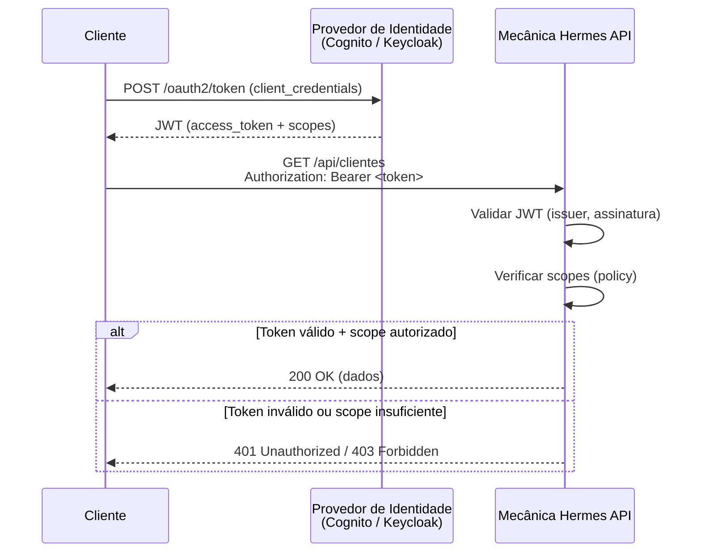

# Autenticação e Autorização

## Mecanismo

A autenticação utiliza **JWT Bearer** com um provedor de identidade externo (ex.: Keycloak, Auth0 ou qualquer provedor compatível com OpenID Connect). O sistema **não gerencia usuários ou senhas internamente** — delega essa responsabilidade inteiramente ao provedor configurado.

A validação do token é feita pelo middleware `JwtBearer` do ASP.NET Core:

- **Issuer** validado via variável de ambiente `AUTH__ISSUER`.
- **Authority** (endpoint OIDC de descoberta) configurado via `AUTH__AUTHORITY`.
- **Audience** não é validada (configuração atual).

## Escopos de Acesso (Policies)

A autorização é baseada em **escopos (scopes) JWT**, configurados via variáveis de ambiente:

| Variável de Ambiente | Descrição |
| --- | --- |
| `AUTH__CLIENTE_SCOPE` | Escopo de acesso padrão (clientes e consultas) |
| `AUTH__ADMIN_SCOPE` | Escopo administrativo com acesso total |

Internamente, dois policies são registrados:

- **`AllowClienteScope`** — exige autenticação e que o token contenha o scope de cliente **ou** o scope de admin.
- **`OnlyAdminScope`** — exige autenticação e que o token contenha exclusivamente o scope de admin.

O escopo é lido do claim `scope` no token JWT. Múltiplos escopos são separados por espaço (padrão OAuth 2.0).

## Fluxo de Autenticação



## Obtenção do Token

O token deve ser obtido diretamente junto ao provedor de identidade externo configurado. Após obtê-lo, inclua-o no header de cada requisição:

```http
Authorization: Bearer <seu-token-jwt>
```

## Autenticação em Desenvolvimento e Testes

Para facilitar o desenvolvimento local e a execução de testes de integração, o middleware `DevelopmentAuthenticationMiddleware` é aplicado automaticamente nos ambientes `Development` e `Testing`.

Quando ativo, ele injeta um usuário autenticado fictício com ambos os escopos (`mecanica-hermes:admin mecanica-hermes:cliente`), eliminando a necessidade de um provedor de identidade externo durante o desenvolvimento.

> **Atenção**: esse middleware nunca é ativado em `Production`.

## Variáveis de Ambiente Necessárias (Produção)

| Variável | Exemplo |
| --- | --- |
| `AUTH__AUTHORITY` | `https://sso.example.com/realms/mecanica` |
| `AUTH__ISSUER` | `https://sso.example.com/realms/mecanica` |
| `AUTH__CLIENTE_SCOPE` | `mecanica-hermes:cliente` |
| `AUTH__ADMIN_SCOPE` | `mecanica-hermes:admin` |
