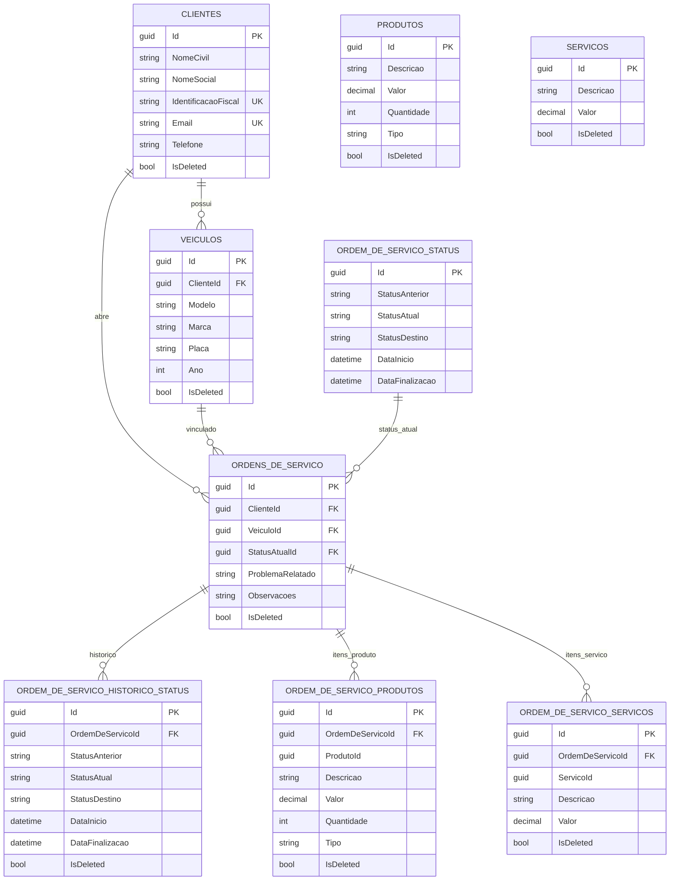

# Banco de Dados

Este documento detalha a decisão pelo PostgreSQL, a modelagem relacional e os relacionamentos principais.

## Justificativa formal da escolha do PostgreSQL

A escolha por PostgreSQL foi baseada nos seguintes critérios técnicos:

1. **Consistência transacional (ACID)** para operações críticas de ordens de serviço.
2. **Modelo relacional robusto** para representar entidades fortemente relacionadas (cliente, veículo, OS, itens e histórico).
3. **Ecossistema maduro no .NET** (Npgsql + EF Core) e boa produtividade no mapeamento.
4. **Recursos de busca textual** utilizados pela aplicação (`unaccent` e `pg_trgm`).
5. **Operação gerenciada em nuvem** via Amazon RDS, reduzindo esforço operacional.

## Ajustes no modelo relacional

A implementação adota ajustes para preservar histórico e garantir flexibilidade:

- **Soft delete (`IsDeleted`)** em tabelas de domínio e filtros globais no EF Core.
- **Índices únicos filtrados** para manter unicidade apenas em registros ativos.
- **Snapshot de itens da OS**:
  - `OrdemDeServicoProdutos` e `OrdemDeServicoServicos` armazenam descrição/valor no momento da ordem.
  - `ProdutoId` e `ServicoId` são referências lógicas (sem FK rígida), preservando histórico mesmo com mudanças futuras em catálogo.
- **Histórico explícito de status** em `OrdemDeServicoHistoricoStatus`.

## Diagrama ER

## Relações e regras de integridade

- `Clientes` 1:N `Veiculos` (cascade no relacionamento de infraestrutura).
- `Clientes` 1:N `OrdensDeServico` (restrito para evitar deleção em cascata indevida).
- `Veiculos` 1:N `OrdensDeServico` (restrito).
- `OrdemDeServicoStatus` 1:N `OrdensDeServico` (status atual referenciado por FK).
- `OrdensDeServico` 1:N `OrdemDeServicoHistoricoStatus`, `OrdemDeServicoProdutos`, `OrdemDeServicoServicos` (cascade).

## Índices relevantes

- `Clientes.IdentificacaoFiscal` (único com filtro `IsDeleted = false`).
- `Clientes.Email` (único com filtro `IsDeleted = false`).
- `Veiculos (ClienteId, Placa)` (único com filtro `IsDeleted = false`).
- `Produtos (Descricao, Tipo)` (único com filtro `IsDeleted = false`).
- `Servicos.Descricao` (único com filtro `IsDeleted = false`).
