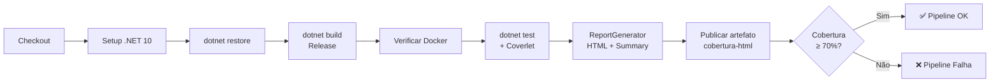
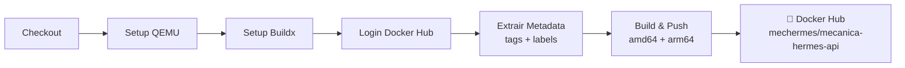

# Continuous Integration e Continuous Delivery

Dois workflows de GitHub Actions automatizam a integração e a entrega do projeto.

## Workflow 1 — Build e Testes (`build-and-tests-ci.yml`)

**Gatilho**: push nas branches `main` e `feature/**`.

### Pipeline (Workflow 1)



### Etapas

1. **Checkout** do código.
2. **Setup .NET 10** — versão do SDK utilizada no build.
3. **Restaurar pacotes** — `dotnet restore`.
4. **Build** — `dotnet build --configuration Release`.
5. **Verificar Docker** — confirma que o Docker está disponível (necessário para Testcontainers nos testes de integração).
6. **Executar testes** — `dotnet test` com coleta de cobertura via Coverlet no formato OpenCover. Exclui migrações do relatório.
7. **Gerar relatório HTML** — ReportGenerator produz HTML + `Summary.json` com métricas de cobertura.
8. **Publicar artefato** — o relatório HTML é publicado como artefato (`cobertura-html`) com retenção de 7 dias.
9. **Threshold de cobertura** — verifica se a cobertura de linhas é **≥ 70%**. O pipeline falha se o threshold não for atingido.

### Secrets necessários (Workflow 1)

Nenhum secret adicional é obrigatório além dos já necessários para o repositório.

### Observações sobre os testes de integração

Os testes de integração (`Mecanica.Hermes.IntegrationTests`) utilizam **Testcontainers** para subir um container PostgreSQL efêmero durante a execução. O ambiente de CI precisa de acesso ao Docker daemon (`unix:///var/run/docker.sock`).

---

## Workflow 2 — Build e Publicação da Imagem Docker (`docker-ci.yml`)

**Gatilho**: push nas branches `main`, `feature/**` e `versao/**`, push de tags `v*.*.*` e evento de release publicada.

### Pipeline



### Etapas do Workflow 2

1. **Checkout** do código.
2. **Setup QEMU** — suporte a build multiplataforma.
3. **Setup Buildx** — builder avançado do Docker.
4. **Login no Docker Hub** — autenticação com as credenciais configuradas nos secrets.
5. **Extração de metadata** — geração automática de tags e labels:
   - `sha-<short-sha>` — rastreabilidade por commit.
   - Nome da branch (ex.: `main`, `feature-xyz`).
   - Versão semântica a partir da tag Git (ex.: `1.2.3`, `1.2`, `1`).
   - `latest` — somente para a branch `main`.
6. **Build e push** — imagem construída a partir do `Dockerfile` na raiz do repositório e publicada no Docker Hub.
   - Plataformas: `linux/amd64` e `linux/arm64`.
   - Cache via GitHub Actions Cache (`type=gha`).

### Secrets necessários (Workflow 2)

| Secret | Descrição |
| --- | --- |
| `DOCKER_USERNAME` | Usuário do Docker Hub |
| `DOCKER_PASSWORD` | Senha ou token de acesso do Docker Hub |

### Imagem publicada

```text
mechermes/mecanica-hermes-api:<tag>
```

---

## Dockerfile

O `Dockerfile` utiliza **multi-stage build**:

- **Estágio `build`**: SDK .NET 10 — restaura dependências e publica a aplicação em modo Release.
- **Estágio `final`**: Runtime ASP.NET 10 — imagem enxuta com apenas os binários publicados.

Práticas de segurança aplicadas:

- Usuário não-root (`appuser`, uid 1001).
- `curl` instalado para o healthcheck HTTP em `/` na porta 8080.
- Variável `ASPNETCORE_ENVIRONMENT=Production` definida no container.
