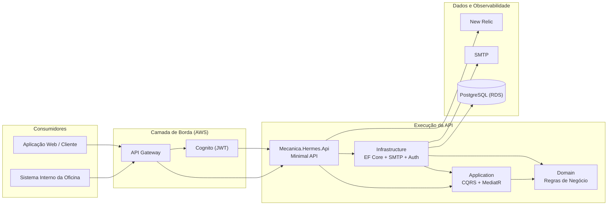

# Diagrama de Componentes

Este documento apresenta a visão de componentes da API, incluindo nuvem, APIs, banco de dados e monitoramento.

## Visão geral

## Responsabilidades por componente

- **API (`Mecanica.Hermes.Api`)**
  - Endpoints HTTP (Minimal API)
  - Middleware de exceções/autenticação em desenvolvimento
  - Exposição de OpenAPI/Scalar
- **Application (`Mecanica.Hermes.Application`)**
  - Casos de uso com CQRS
  - Handlers MediatR
  - Portas (interfaces) de saída
- **Domain (`Mecanica.Hermes.Domain`)**
  - Agregados, Value Objects, Domain Events
  - State Pattern para ciclo da Ordem de Serviço
- **Infrastructure (`Mecanica.Hermes.Infrastructure`)**
  - Persistência (EF Core/Npgsql)
  - Implementações de repositórios
  - Integração SMTP
  - Configuração de autenticação

## Fluxos de integração relevantes

1. **Autenticação**: token JWT emitido por Cognito, validado pela API.
2. **Persistência**: escrita/leitura no PostgreSQL via EF Core.
3. **Notificações**: envio de e-mails via SMTP.
4. **Observabilidade**: métricas e telemetria enviadas ao New Relic no ambiente Kubernetes.
