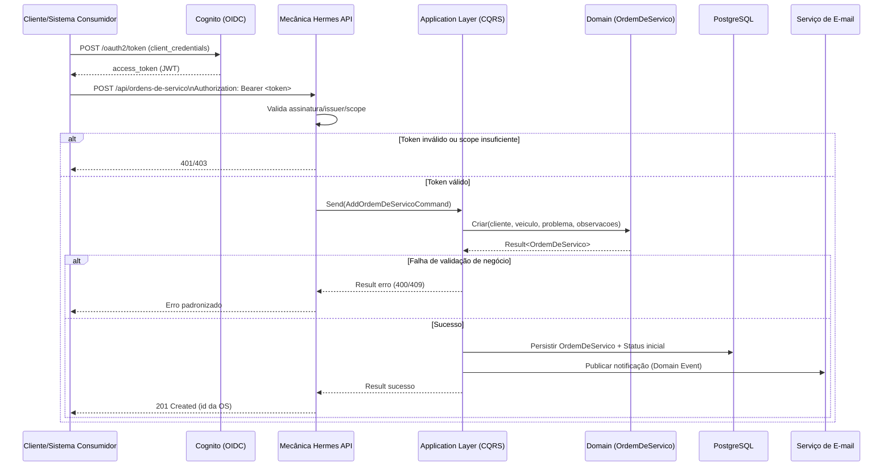

# Fluxo de Autenticação e Abertura de Ordem de Serviço

Este documento detalha o fluxo de autenticação JWT e o fluxo de abertura de ordem de serviço na API.

## Diagrama de sequência

## Regras importantes no fluxo

- O status inicial da OS é **`Recebida`**.
- A autorização é baseada em escopos JWT (`AUTH__CLIENTE_SCOPE` e `AUTH__ADMIN_SCOPE`).
- Erros de domínio usam o `Result Pattern`, retornando respostas HTTP coerentes.
- Notificações são disparadas por **Domain Events** após persistência.
