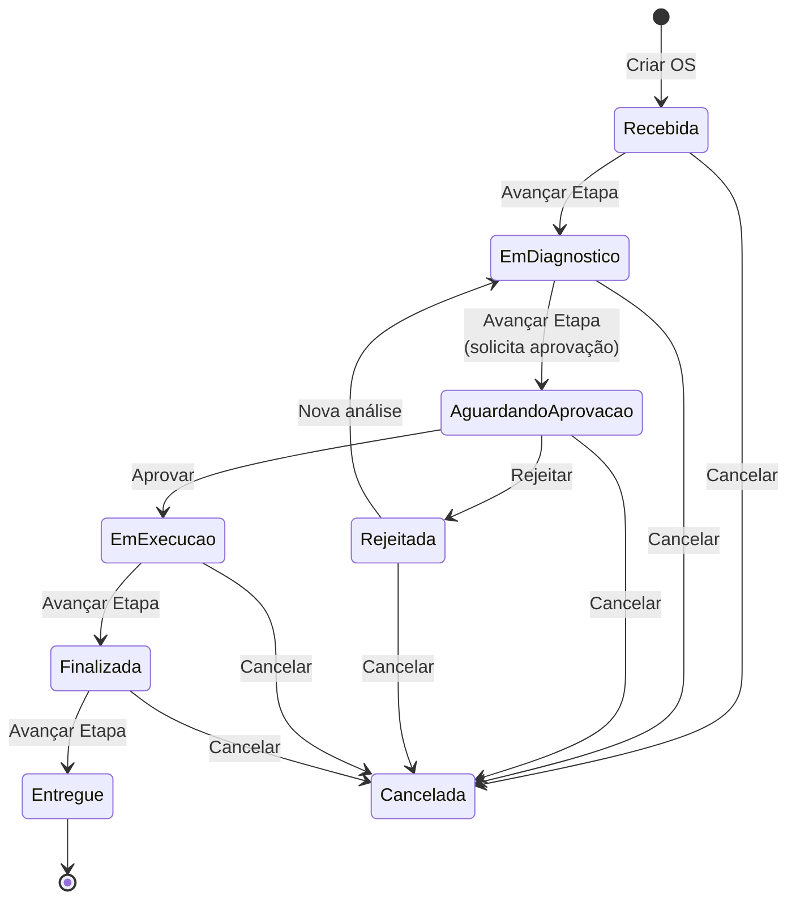

# Fluxo de Ordem de Serviço

- **Atores**: Atendente, Mecânico, Cliente, Sistema (notificações por e-mail).
- **Objetivo**: Receber o veículo, diagnosticar o problema, elaborar e aprovar o orçamento, executar o serviço e devolver o veículo ao cliente.

## Ciclo de Vida (State Pattern)

O status da OS é gerenciado pelo **State Pattern** no domínio. Cada transição é disparada por um comando específico e registrada no histórico de status (`OrdemDeServicoHistoricoStatus`).

> **Nota**: o status `Recebida` é o estado inicial criado internamente quando não há ainda um diagnóstico em andamento. O fluxo operacional inicia no `EmDiagnostico`.

## Descrição das Etapas

### 1. Pré-requisito — Cadastro de Cliente e Veículo

- Cliente e veículo devem estar cadastrados antes de abrir uma OS.
- O e-mail do cliente é obrigatório para o envio de notificações.

### 2. Abertura da Ordem de Serviço

- O atendente cria a OS informando o cliente, o veículo e o problema relatado.
- A OS nasce no status **Recebida**.
- Um Domain Event (`OrdemDeServicoCriadoEvent`) é disparado, podendo acionar notificações.

### 3. Diagnóstico e Elaboração do Orçamento

- Enquanto a OS está em **EmDiagnostico**, o mecânico pode:
  - Adicionar e remover **produtos** (peças/insumos) com quantidade.
  - Adicionar e remover **serviços** a serem realizados.
- O valor total é calculado automaticamente: `Σ(produto.valor × quantidade) + Σ(serviço.valor)`.

### 4. Solicitação de Aprovação

- O atendente/mecânico solicita aprovação, avançando a OS para **AguardandoAprovacao**.
- A partir desse ponto, produtos e serviços **não podem mais ser editados** (`PermiteEditarProdutos = false`).
- O sistema notifica o cliente por e-mail com o resumo do orçamento.

### 5. Aprovação ou Rejeição pelo Cliente

- **Aprovar**: a OS avança para **EmExecucao**. A oficina é notificada para iniciar os trabalhos.
- **Rejeitar**: a OS vai para **Rejeitada**. Uma nova análise pode ser iniciada, retornando ao **EmDiagnostico**.

### 6. Execução e Finalização

- Com status **EmExecucao**, o mecânico realiza o serviço.
- Ao concluir, avança para **Finalizada**.
- O sistema notifica o cliente que o veículo está pronto para retirada.

### 7. Entrega / Encerramento

- O atendente confirma a retirada do veículo, avançando para **Entregue**.
- O sistema envia confirmação de entrega ao cliente por e-mail.

### Cancelamento

- Qualquer OS pode ser cancelada (status **Cancelada**), exceto as já **Entregues** e as já **Canceladas**.

## Mapeamento de Endpoints

| Ação | Método | Endpoint |
| --- | --- | --- |
| Criar OS | `POST` | `/api/ordens-de-servico` |
| Consultar OS por ID | `GET` | `/api/ordens-de-servico/{id}` |
| Listar OSs | `GET` | `/api/ordens-de-servico` |
| Adicionar produto à OS | `POST` | `/api/ordens-de-servico/{id}/produtos` |
| Remover produto da OS | `DELETE` | `/api/ordens-de-servico/{id}/produtos/{produtoId}` |
| Adicionar serviço à OS | `POST` | `/api/ordens-de-servico/{id}/servicos` |
| Remover serviço da OS | `DELETE` | `/api/ordens-de-servico/{id}/servicos/{servicoId}` |
| Solicitar aprovação | `POST` | `/api/ordens-de-servico/{id}/solicitar-aprovacao` |
| Aprovar OS | `POST` | `/api/ordens-de-servico/{id}/aprovar` |
| Rejeitar OS | `POST` | `/api/ordens-de-servico/{id}/rejeitar` |
| Avançar etapa | `POST` | `/api/ordens-de-servico/{id}/avancar-etapa` |
| Cancelar OS | `POST` | `/api/ordens-de-servico/{id}/cancelar` |
